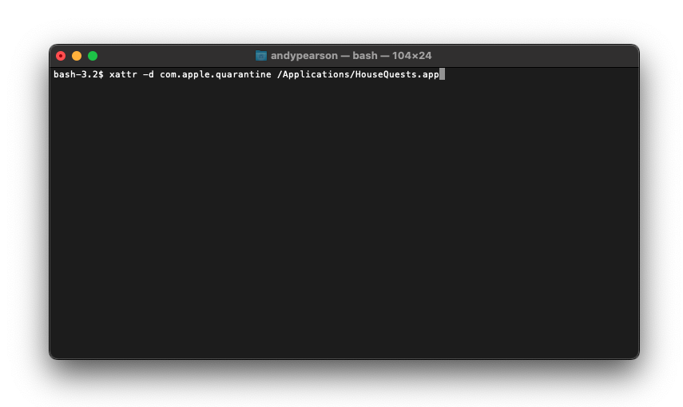

# 🖥 MacOS Installation Problems

## Error: "HouseQuests.app is damaged and can't be opened. You should move it to the trash" 

If you get the error "HouseQuests.app is damaged and can't be opened. You should move it to the trash", read on:

Currently, we do not have an Apple certificate (Which costs money to Apple). This means that the HouseQuests application will be automatically quarantined by MacOS v11 (Big Sur+) on any M1/M2-based machines. This is a move by Apple to force developers to purchase their certificates.

All you need to do is remove HouseQuests from the Quarantine. To do so, open the `terminal` app (applications folder > Utilities) and copy/paste the following into the command line:

```
xattr -d com.apple.quarantine /Applications/HouseQuests.app
```

Then press `⏎ enter`.

